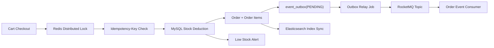

# Redis Online Shop

一个基于 Spring Boot 3、Redis、MySQL、MyBatis-Plus、RocketMQ、Elasticsearch 的在线商城后端项目。项目围绕真实电商链路构建：注册登录、JWT 鉴权、商品缓存、商品全文检索、购物车、幂等结算、库存扣减、订单落库、Transactional Outbox、RocketMQ 异步消息、接口限流、请求追踪和健康检查。

## 技术栈

- Java 21
- Spring Boot 3.2.5
- Spring Web / Validation / Security / Actuator / Scheduling
- Spring Data Redis
- Redis String / Redis Stream / Lua
- RocketMQ Spring Boot Starter
- Spring Data Elasticsearch
- MyBatis-Plus 3.5.5
- MySQL 8.x
- Maven
- JUnit 5 + Mockito

## 核心能力

- 用户注册、登录、退出、会话校验
- JWT Bearer Token 鉴权，支持 `jti`、过期校验、签名防篡改和 Redis 黑名单登出
- 兼容 `X-Session-ID` 与 `Authorization: Bearer <token>` 两种认证方式
- Redis 缓存商品、用户、会话和购物车数据
- 商品创建、更新、删除、详情、搜索、热门商品、分页
- Elasticsearch 商品全文检索，支持名称、描述、分类搜索
- 商品增删改和库存扣减后同步 Elasticsearch 索引
- Elasticsearch 不可用时自动降级到 MySQL `LIKE` 查询
- 购物车增删改查、合并、清空和结算
- 结算接口支持 `Idempotency-Key`，避免重复提交导致重复下单
- Redis 分布式锁保护同一用户的并发结算流程
- MySQL 条件更新保护库存，避免超卖
- 结算成功后生成订单和订单明细，保存商品快照价格
- Transactional Outbox 保证订单落库与消息投递最终一致
- RocketMQ 发布并消费 `ORDER_CREATED` 订单事件
- Redis Stream 可作为本地消息队列降级通道
- Redis 固定窗口限流保护 `/api/**`
- 定时任务预热商品缓存
- 低库存预警：结算扣减库存后自动检查阈值并输出预警日志
- 统一异常响应、traceId、Actuator 健康检查和基础指标

## 快速启动

1. 创建数据库：

```sql
CREATE DATABASE IF NOT EXISTS online_shop DEFAULT CHARSET utf8mb4;
```

2. 准备环境变量：

```bash
cp .env.example .env
```

3. 修改 `.env` 中的 MySQL、Redis、RocketMQ、Elasticsearch、JWT 密钥和限流配置。

4. 启动项目：

```bash
mvn spring-boot:run
```

应用默认启动在 `http://localhost:8080`。首次启动会执行 `src/main/resources/schema.sql` 初始化表结构。

如果本地没有 RocketMQ，可以临时设置：

```bash
ORDER_EVENT_BACKEND=redis-stream
```

这样订单事件会使用 Redis Stream 通道，便于本地开发。

如果本地没有 Elasticsearch，可以临时设置：

```bash
ELASTICSEARCH_ENABLED=false
```

这样商品搜索会自动使用 MySQL 查询。

## 认证方式

登录接口会同时返回 `sessionId` 和 `accessToken`：

```bash
curl -X POST http://localhost:8080/api/users/login \
  -H "Content-Type: application/json" \
  -d "{\"username\":\"john_doe\",\"password\":\"password123\"}"
```

后续接口可以任选一种方式认证：

```bash
# JWT
curl http://localhost:8080/api/cart \
  -H "Authorization: Bearer <accessToken>"

# Redis Session
curl http://localhost:8080/api/cart \
  -H "X-Session-ID: <sessionId>"
```

退出登录时，如果传入 JWT，会将 token 的 `jti` 写入 Redis 黑名单直到 token 自然过期：

```bash
curl -X POST http://localhost:8080/api/users/logout \
  -H "Authorization: Bearer <accessToken>"
```

## 常用接口

### 用户

- `POST /api/users/register`
- `POST /api/users/login`
- `POST /api/users/logout`
- `GET /api/users/profile`
- `GET /api/users/validate-session`
- `GET /api/users/page?pageNum=1&pageSize=10`

### 商品

- `GET /api/products`
- `GET /api/products/{id}`
- `POST /api/products`
- `PUT /api/products/{id}`
- `DELETE /api/products/{id}`
- `GET /api/products/hot`
- `GET /api/products/search?keyword=phone&category=electronics`
- `POST /api/products/search/rebuild`
- `GET /api/products/page?pageNum=1&pageSize=10`

`/api/products/search` 默认优先使用 Elasticsearch；`/api/products/search/rebuild` 用于从 MySQL 重建商品搜索索引。

### 购物车

- `GET /api/cart`
- `POST /api/cart/items`
- `PUT /api/cart/items/{productId}?quantity=2`
- `DELETE /api/cart/items/{productId}`
- `DELETE /api/cart`
- `POST /api/cart/merge`
- `POST /api/cart/checkout`

结算接口建议携带 `Idempotency-Key`：

```bash
curl -X POST http://localhost:8080/api/cart/checkout \
  -H "Authorization: Bearer <accessToken>" \
  -H "Idempotency-Key: checkout-20260514-001"
```

### 订单

- `GET /api/orders?pageNum=1&pageSize=10`
- `GET /api/orders/{id}`

### 运维

- `GET /actuator/health`
- `GET /actuator/info`
- `GET /actuator/metrics`

## Redis Key 设计

| Key | 说明 | TTL |
| --- | --- | --- |
| `product:{id}` | 商品详情缓存 | 1 小时 |
| `all:products` | 商品列表缓存 | 1 小时 |
| `hot:products` | 热门商品缓存 | 30 分钟 |
| `cart:{userId}` | 用户购物车 | 24 小时 |
| `session:{sessionId}` | 用户会话 | 24 小时 |
| `user:{id}` | 用户详情缓存 | 24 小时 |
| `user:username:{name}` | 用户名查询缓存 | 24 小时 |
| `lock:checkout:{userId}` | 结算分布式锁 | 15 秒 |
| `idempotency:checkout:{userId}:{key}` | 结算幂等结果 | 24 小时 |
| `jwt:revoked:{jti}` | JWT 黑名单 | token 剩余有效期 |
| `rate-limit:{ip}:{method}:{uri}:{window}` | 固定窗口限流计数 | 限流窗口期 |
| `stream:orders` | 订单事件消息队列 | 持久化 Stream |
| `stream:orders:dlq` | 订单事件死信队列 | 持久化 Stream |

## 消息队列与 Outbox

订单创建成功后，系统不会在事务中直接依赖 MQ 成败，而是先把事件写入 `event_outbox` 表。`OrderOutboxService` 定时扫描 `PENDING` 事件并投递到 RocketMQ，发送成功后标记为 `SENT`，失败时增加重试次数，超过阈值标记为 `FAILED`。

默认配置：

- RocketMQ NameServer：`localhost:9876`
- RocketMQ Topic：`shop-order-events`
- RocketMQ Tag：`ORDER_CREATED`
- RocketMQ Consumer Group：`shop-order-event-consumer`
- Outbox Relay：每 5 秒扫描一次，默认最多重试 5 次

本地降级配置：

- `ORDER_EVENT_BACKEND=redis-stream`
- Stream：`stream:orders`
- Consumer Group：`order-service`
- Consumer Name：`order-service-1`
- DLQ：`stream:orders:dlq`

## 架构流程



## 测试

```bash
mvn test
```

当前测试覆盖用户服务、JWT 签发验签、商品服务、Elasticsearch 搜索降级、购物车结算、幂等控制、订单落库、Outbox 事件落库和事件发布等核心逻辑。
